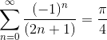

# 計算スピードの比較


ライプニッツ級数




は収束が遅いので言語毎に計算要する時間を評価する．和の上限をnmax=$10^8$とする．

```
$ cat /proc/cpuinfo  
model name	: Intel(R) Xeon(R) CPU E5-1680 v3 @ 3.20GHz
```

gnu版のtimeはメモリーの使用量も計測できるのでgnu版を使う

注意としてubuntu(bash)のtimeコマンドにはbash版gnu版がありgnu版を使うためには

```
$ /usr/bin/time
```

もしくは

```
\time
```

とすれば良いようだ．フォーマットは以下のようにして出力する

```
$ fmt="\nreal:%e\nuser:%U\nsys:%S\nMemory:%M[KB]"
\time -f ${fmt} ./LeibnizFormula
```

どの言語を学ぶべきかは，[このひとの解説](http://www.mwsoft.jp/column/program_top10.html)が楽しい

## C言語

なんだかんだ慣れ死んだC言語

[ソースコード](LeibnizFormula.c)

```
$ gcc -o LeibnizFormula LeibnizFormula.c -lm
$ \time -f ${fmt} ./LeibnizFormula
Ans:3.1415926635893259

real:3.68[sec]
user:3.67[sec]
sys:0.00[sec]
Memory:624[KB]
```

## fortran

fortranは永遠に生き残る気がする良い言語

[ソースコード](LeibnizFormula.f90)

```
$ \time -f ${fmt} ./LeibnizFormula
 Ans:   3.1415926653536932     

real:4.99[sec]
user:4.99[sec]
sys:0.00[sec]
Memory:936[KB]

```

## [python](https://www.python.org/)

今カノだけど，浮気中

[ソースコード](LeibnizFormula.py)

結果 numbaが早い

```
$ \time -f ${fmt} python LeibnizFormula.py LeibnizFormula1
3.141592663589326
real:49.65[sec]
user:49.60[sec]
sys:0.03[sec]
Memory:44316[KB] = 43[MB]

$ \time -f ${fmt} python LeibnizFormula.py LeibnizFormula2
3.14159266359
real:51.82[sec]
user:50.76[sec]
sys:1.03[sec]
Memory:3990024[KB] = 3896[MB] = 3.8[GB]

$ \time -f ${fmt} python LeibnizFormula.py LeibnizFormula3
3.14159266359
real:50.18[sec]
user:49.13[sec]
sys:1.02[sec]
Memory:3989640[KB] = 3896[MB] = 3.8[GB]

$ \time -f ${fmt} python LeibnizFormula.py LeibnizFormula4
3.141592663589326
real:3.93[sec]
user:3.89[sec]
sys:0.03[sec]
Memory:52848[KB] = [51MB]
```

## Wolfram言語 (Mathematica)

本妻

[ソースコード](LeibnizFormula.wl)

```
$ \time -f ${fmt} wolframscript -script LeibnizFormula.wl
3.141592663589326

real:4.99[sec]
user:4.88[sec]
sys:0.13[sec]
Memory:80456[KB] = 78[MB]
```

ParallelSumに書き直すともっと早くなるけどここでは試さない

## [Haskell](https://www.haskell.org/)

お堅い愛人

[ソースコード](LeibnizFormula.hs)

listを作ると，大量のメモリを食らってしまうのでlistを作らない書き方の方が良いと思う．
もっと賢い実装があると思うけど，思いつたら加筆します．

```
$ ghc -O -rtsopts -with-rtsopts=-K20G LeibnizFormula.hs
$ \time -f ${fmt} ./LeibnizFormula
3.141592663589326

real:36.90[sec]
user:32.70[sec]
sys:4.11[sec]
Memory:16264736[KB] = 15883[MB] = 15[GB]
```

## [Julia](https://julialang.org/)

本ノートのきっかけを与えてくれた言語．現在キープさん

[ソースコード](LeibnizFormula.jl)

```
$ \time -f ${fmt} julia LeibnizFormula.jl
3.141592663589326

real:8.76[sec]
user:8.70[sec]
sys:0.89[sec]
Memory:182372[KB] = 178[MB]
```

## Java

知らない娘

[ソースコード](LeibnizFormula.java)

```
$ javac LeibnizFormula.java
$ \time -f ${fmt} java -cp . LeibnizFormula
Ans:3.1415926545880506

real:79.54[sec]
user:79.54[sec]
sys:0.04[sec]
Memory:28544[KB] = 27[MB]
```

## Javascript

意外と早い娘

[ソースコード](LeibnizFormula.java)

```
$ \time -f ${fmt} node LeibnizFormula.js
3.141592663589326

real:4.94[sec]
user:4.95[sec]
sys:0.02[sec]
Memory:10956[KB] = 10[MB]
```

## bash

じつは計算できる娘だけど，めちゃくちゃ遅い．ここでは$nmax = 10^4$とした．

[ソースコード](LeibnizFormula.sh)

  ```
$ \time -f ${fmt} bash LeibnizFormula.sh
3.141692643590542976

real:44.47[sec]
user:4.99[sec]
sys:50.23[sec]
Memory:1548[KB]
```

## Lisp

かっこかっこかっこ

[ソースコード](LeibnizFormula.lsp)

```
$ \time -f ${fmt} clisp LeibnizFormula.lsp

3.1415968

real:177.54
user:174.38
sys:3.05
Memory:6832[KB]
```


# Scala

遅いかと思いきや案外そうでもない

[ソースコード](LeibnizFormula.scala)

```
$ \time -f ${fmt} scala LeibnizFormula.scala
3.141592663589326

real:8.14
user:7.97
sys:0.03
Memory:41892[KB]
```
